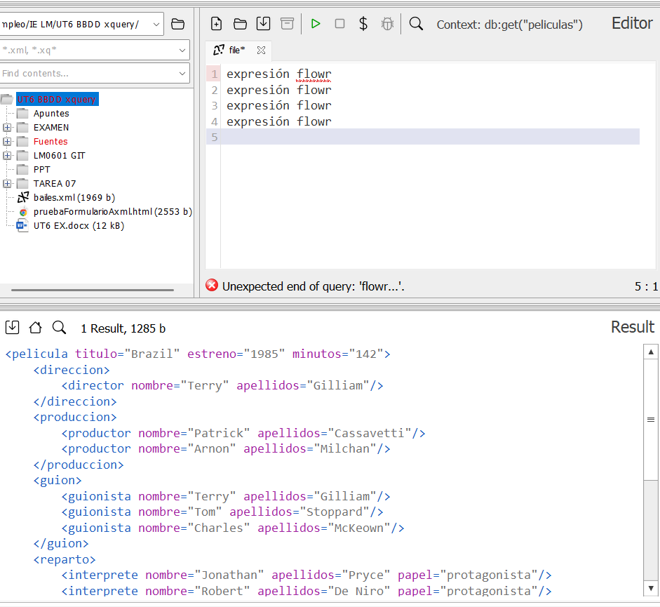

### **Ejercicio 1** : 1 p 
 📌 **Muestra la nota media de los alumnos.**  
- Debes calcular la media de todas las notas de los alumnos.  
- Se aceptará la solución que use `FLWOR`.

```
expresión flowr
expresión flowr
expresión flowr
expresión flowr
expresión flowr
```
